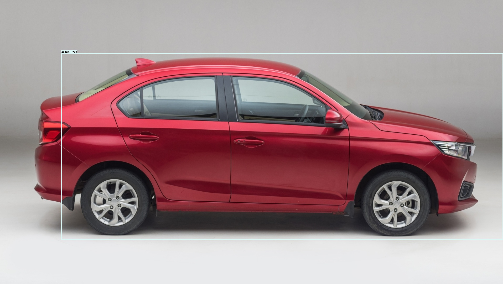
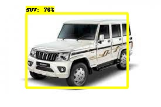

# car_detection based on size
This repo is of  the basic car detection and classification based on type like SUV,MUV,Sedan etc and it is based on the newly introduced TensorFlow Object Detection API for training a custom object detector with TensorFlow 2.X versions. The steps mentioned mostly follow this [documentation](https://tensorflow-object-detection-api-tutorial.readthedocs.io/en/latest/training.html#), however I have simplified the steps and the process


In this repository, I have gathered and labelled my own dataset for car detection based on type
Dataset is contain inside workspace/data
I have created 5 labels inside label_map.pbtxt:

```
item {
    name: "MUV",
    id: 1,
    display_name: "MUV"
}
item {
    name: "SUV",
    id: 2,
    display_name: "SUV"
}
item {
    name: "hatchback",
    id: 3,
    display_name: "hatchback"
}
item {
    name: "mini van",
    id: 4,
    display_name: "mini van"
}
item {
    name: "sedan",
    id: 5,
    display_name: "sedan"
}

```

I have taken pretrained STOA model EfficientDet D1 640x640 from [TensorFlow 2 Detection Model Zoo](https://github.com/tensorflow/models/blob/master/research/object_detection/g3doc/tf2_detection_zoo.md)


Real beauty of choosing TensorFlow Object Detection API is that we can choose to do transfer learning from any of STOA model available in TensorFlow 2 Detection Model Zoo.

## The Steps
### Git clone the repo
```
https://github.com/srj-surajchauhan/car_detection_pract.git
```
This should clone all the files in a directory called car_detection.

Go to  project directory:
```
cd car_detection_pract/
```


create venv via pip
```
pip3 install virtualenv
virtualenv venv
```
activate virtual environment
```
source venv/bin/activate
```
Install dependencies with 

```
pip3 install requirment.txt
```

Then, your directory structure should look something like this:

```
TensorFlow/
└─ images/
└─ models/
   ├─ community/
   ├─ official/
   ├─ orbit/
   ├─ research/
└─ scripts/
└─ workspace/
```
After we have setup the directory structure, we must install the prequisites for the Object Detection API. First we need to install the protobuf compiler

```
pip3 install protobuf
sudo apt  install protobuf-compiler
```
Then you should cd in to the TensorFlow\models\research directory

```
cd models/research
```
Then compile the protos

```
protoc object_detection/protos/*.proto --python_out=.
```

With TensorFlow 2, pycocotools is a dependency for the Object Detection API. 

```
pip3 install cython
pip3 install git+https://github.com/philferriere/cocoapi.git#subdirectory=PythonAPI
```

Go back to the models/research directory with 

```
cd models\research
```

Once here, copy and run the setup script with 
sudo apt  install protobuf-compiler 
```
cp object_detection/packages/tf2/setup.py .
python3 -m pip install .
```
If there are any errors, report an issue, but they are most likely pycocotools issues meaning your installation was incorrect. But if everything went according to plan you can test your installation with

```
python object_detection/builders/model_builder_tf2_test.py
```
You should get a similar output to this

```
[       OK ] ModelBuilderTF2Test.test_create_ssd_models_from_config
[ RUN      ] ModelBuilderTF2Test.test_invalid_faster_rcnn_batchnorm_update
[       OK ] ModelBuilderTF2Test.test_invalid_faster_rcnn_batchnorm_update
[ RUN      ] ModelBuilderTF2Test.test_invalid_first_stage_nms_iou_threshold
[       OK ] ModelBuilderTF2Test.test_invalid_first_stage_nms_iou_threshold
[ RUN      ] ModelBuilderTF2Test.test_invalid_model_config_proto
[       OK ] ModelBuilderTF2Test.test_invalid_model_config_proto
[ RUN      ] ModelBuilderTF2Test.test_invalid_second_stage_batch_size
[       OK ] ModelBuilderTF2Test.test_invalid_second_stage_batch_size
[ RUN      ] ModelBuilderTF2Test.test_session
[  SKIPPED ] ModelBuilderTF2Test.test_session
[ RUN      ] ModelBuilderTF2Test.test_unknown_faster_rcnn_feature_extractor
[       OK ] ModelBuilderTF2Test.test_unknown_faster_rcnn_feature_extractor
[ RUN      ] ModelBuilderTF2Test.test_unknown_meta_architecture
[       OK ] ModelBuilderTF2Test.test_unknown_meta_architecture
[ RUN      ] ModelBuilderTF2Test.test_unknown_ssd_feature_extractor
[       OK ] ModelBuilderTF2Test.test_unknown_ssd_feature_extractor
----------------------------------------------------------------------
Ran 20 tests in 45.304s

OK (skipped=1)
```
This means we successfully set up the  Directory Structure and TensorFlow Object Detection API. 

### Model inference:

To test out your model, you can use the sample object detection script I provided called ```TF-image.py```. This should be located in ```workspace/training```.
The usage of each program looks like 

```
usage: TF-image.py [-h] [--model MODEL] [--labels LABELS] [--image IMAGE] [--threshold THRESHOLD]

optional arguments:
  -h, --help            show this help message and exit
  --model MODEL         Folder that the Saved Model is Located In
  --labels LABELS       Where the Labelmap is Located
  --image IMAGE         Name of the single image to perform detection on
  --threshold THRESHOLD Minimum confidence threshold for displaying detected objects
```
If the model or labelmap is located anywhere other than where I put them, you can specify the location with those arguments. You must also provide an image to perform inference on.

```
cd workspace/training
```

Then to run the script, just use

```
python TF_image.py --model=../exported-models/my_trained_model/ --labels=../data/label_map.pbtxt --image=../images/test/20.jpg 
``` 


If everything works properly you should get an output similar to this
<p align="center">
  




</p>
**these results are only based on half training of data**

**we got are initial output but we can improve are accuracy by training on more data aswell as by choosing another initial pretrained weight if required.**
